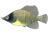
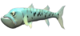
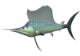
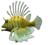

#                                              STARVING FISH

# I. THÔNG TIN TÁC GIẢ

  Họ và tên: Nguyễn Anh Tuấn  
  Mã sinh viên: 24022840
  Lớp: K69I-CN2  
  Email: g0393737874@gmail.com  

# CÁCH CHƠI

Di chuyển cá để ăn những con cá khác. Nếu cá của bạn ăn những con cá hợp lệ, nó sẽ nhận được điểm tương ứng với những con cá khác nhau. Ngược lại, nếu cá của bạn ăn cá bất hợp pháp hoặc bom, bạn sẽ mất mạng. Nếu cá của bạn đạt 1000 điểm, bạn sẽ thắng trò chơi này. Bạn ăn càng nhiều cá, kích thước cá của bạn càng lớn. Mặt khác, bạn sẽ thua khi mạng sống của cá hết.

# CÁCH DI CHUYỂN

- Các phím mũi tên lên, xuống, trái, phải để di chuyển cá của bạn. 
- Nhấn nút ở góc dưới bên phải để bật/tắt âm thanh.

# ĐIỂM

Bạn sẽ nhận được điểm khác nhau khi ăn các loại cá khác nhau:   
     : 5 points  
 : 6 points  
 : 7 points  
 : 8 points  
 : 9 points  
 : 10 points  
Điểm số được hiển thị ở góc trên bên trái của màn hình.  

# MẠNG

Thanh mạng được hiển thị ở góc trên bên phải của màn hình.

# Tính năng nổi bật

- Nhiều loại cá khác nhau.
- Kích thước cá của bạn có thể thay đổi.
- Bot có thể theo dõi vị trí của cá.
- Khi có thể ăn một con cá, nó sẽ quay lại khi di chuyển gần đến cá của bạn.
- Có hiệu ứng âm thanh khi cá của bạn ăn một con cá khác và cá của bạn va chạm với quả bom.
- Bot xuất hiện ngẫu nhiên dựa trên điểm của bạn. Điểm của bạn càng cao, càng có nhiều cá lớn hơn xuất hiện.

# Tôi đã sử dụng

- Thư viện của SDL2.
- Tài nguyên Sprites cho các sprite.
- Phông chữ cho văn bản trong trò chơi của tôi.
- Hiệu ứng âm thanh.  

